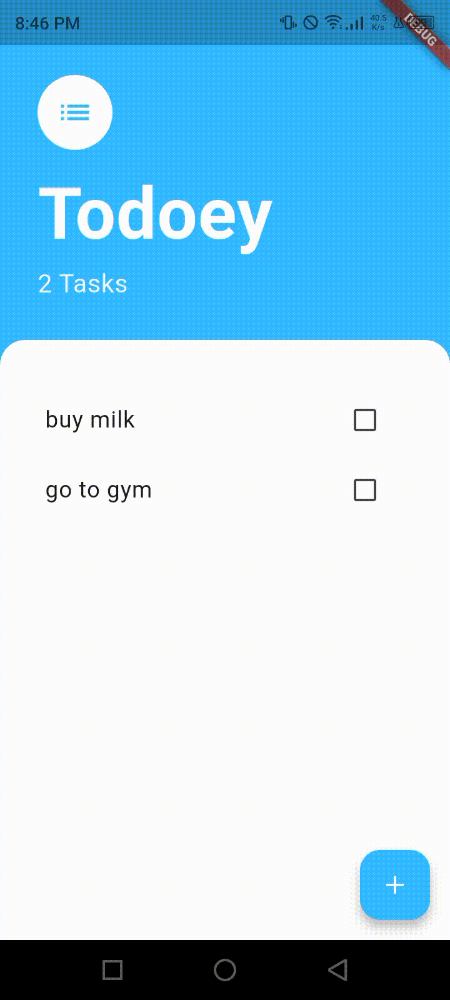

# 📝 Todoey – Flutter To-Do App

A simple and clean **To-Do application built with Flutter**, using **Provider** for state management.  
This project demonstrates best practices for separating UI and logic, managing app state, and building reusable widgets.

---

## 📱 Features

- ✅ Add new tasks  
- ☑️ Mark tasks as completed  
- 🗑️ Delete tasks with a long press  
- 🔄 Real-time UI updates using **Provider**  
- 📦 Clean architecture (Models, Screens, Widgets)

---

## 🎥 App Preview

<p align="center">
  
</p>

---

## 🧠 State Management

This app uses **Provider** with `ChangeNotifier` to manage tasks:

- `TaskData` handles:
  - Task list
  - Add / update / delete operations
  - Notifying listeners when data changes

---

## 🗂️ Project Structure

```text
lib/
│
├── models/
│   ├── task.dart
│   └── task_data.dart
│
├── screens/
│   ├── tasks_screen.dart
│   └── add_task_screen.dart
│
├── widgets/
│   ├── task_tile.dart
│   └── tasks_list.dart
│
└── main.dart
````

---

## 🚀 Getting Started

### Prerequisites

* Flutter SDK
* Dart
* Android Studio / VS Code

### Installation

```bash
git clone https://github.com/GhBMpr/Todoey.git
cd Todoey
flutter pub get
flutter run
```

---

## 📦 Dependencies

```yaml
provider: ^6.0.0
```

---

## 🛠️ Built With

* **Flutter**
* **Dart**
* **Provider**
* **Material Design**

---

## 🎯 What I Learned

* Using `ChangeNotifier` and `Consumer`
* State management with Provider
* Widget separation and clean architecture
* Handling user input and UI updates efficiently

---

## 👤 Author

**Ghofrane BM**
🎓 Student
📍 Tunisia


---

## ⭐️ Support

If you like this project, consider giving it a ⭐️ on GitHub!
